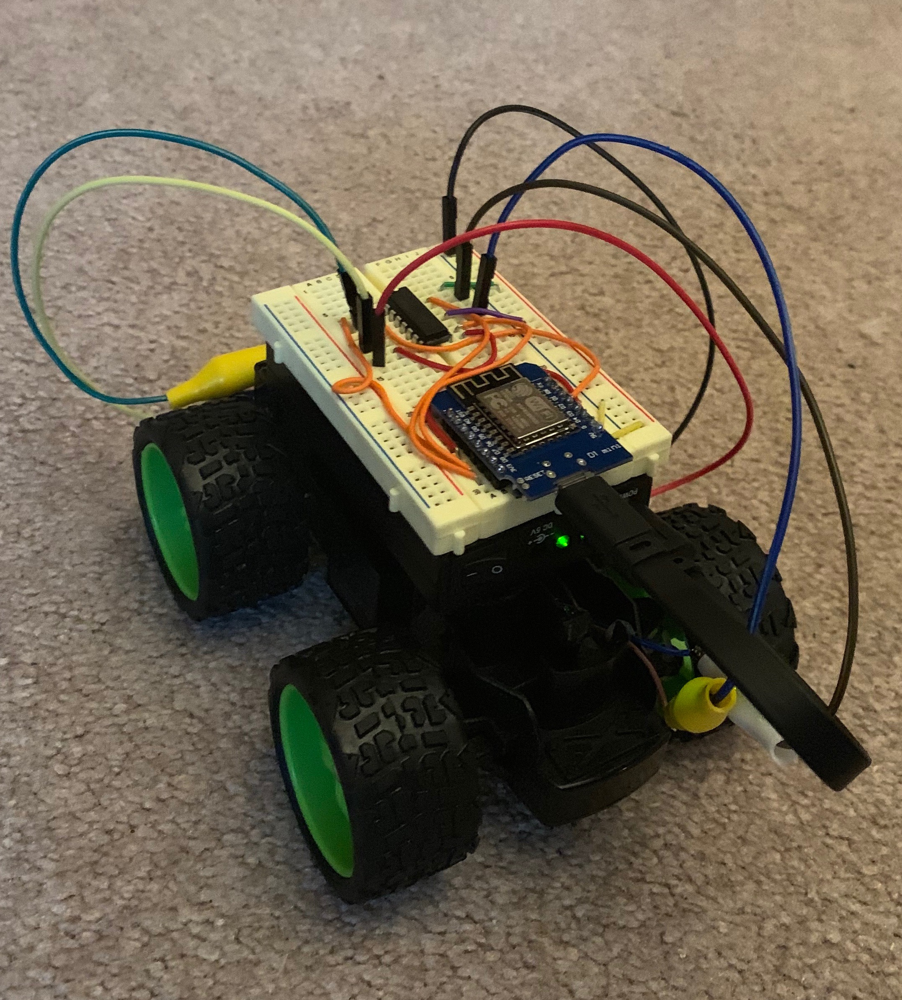

# esp8266-rc-car
Arduino Code for an RC car made with a WEMOS D1 Mini and an L293D Stepper motor IC

 - I used an old RC car that did not have a controller anymore for the frame motors and wheels. 
 - The "leftMotor" in the code is for steering and is located in the front of the frame and turns to a stop for right or left steering. 
 - The "rearMotor" is the motor in the back of the vehicle that controls forward and reverse motion. 

The wemos and the l293d are on a breadboard and wired up based on the pinout in the code. The power for the motors is provided by a 9V battery and the wemos and the IC are powered by a 5v battery pack and a USB cable. The whole thing could be powered by the 5v battery pack but it would die quickly. The IC will handle up to 36v and could be used to control a much larger vehicle. 

